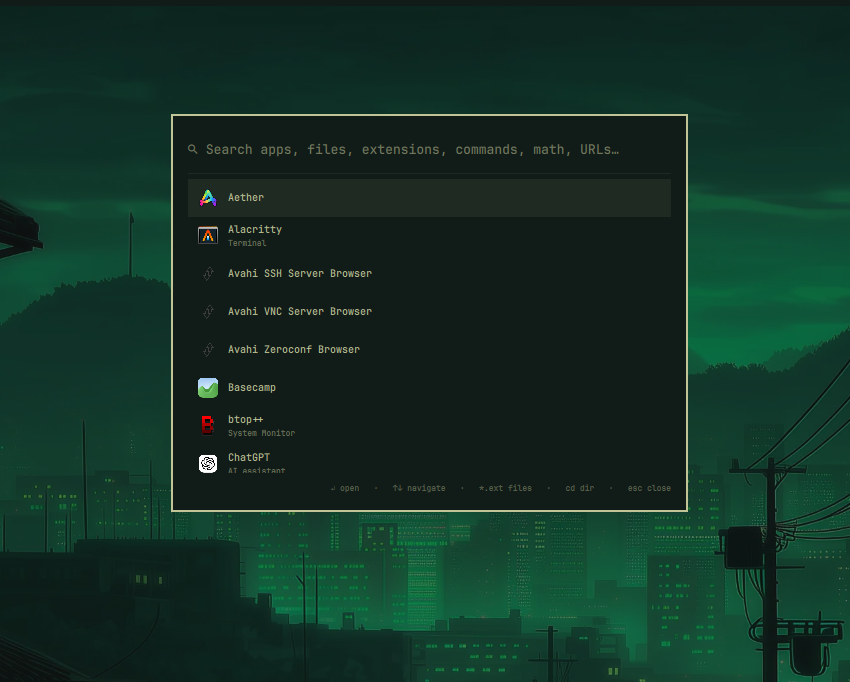

# mihai.spotlight

A Spotlight-style launcher for [Omarchy](https://omarchy.org) — fuzzy-search apps, find any file, run commands, do math, and open URLs, all from one overlay.

Built as an [Omarchy plugin](https://github.com/basecamp/omarchy) on top of Quickshell/QML. It matches your current theme out of the box.



## Features

- **App launcher** — fuzzy search across installed apps with smart ranking (prefix match, multi-word acronyms like `vsc` → Visual Studio Code, keywords, generic names)
- **File & folder search** — searches your home directory by name via [`fd`](https://github.com/sharkdp/fd), results sorted by most recently modified
  - Extension mode: type `*.pdf`, `.conf`, `.md` … to filter by extension
- **Run commands** — type any command found in `PATH` (`btop`, `fastfetch`, `pacman -Qs …`)
  - TUI programs (vim, htop, lazygit, ranger…) run interactively; one-shot commands keep the terminal open so you can read the output
  - Wrapper commands like `sudo …`, `watch …`, `env …` work too
- **Open folders in terminal** — `cd ~/Projects` launches a terminal at that directory
- **Open URLs** — anything that looks like a link (`example.com`, `www.foo.org`) opens in your default browser
- **Inline calculator** — type an expression like `(1920 * 2) / 3`; press Enter to copy the result to the clipboard
- **Quick actions** — screenshot (region/fullscreen), screen recording, lock screen, night light toggle
- **Omarchy menu built in** — the full `omarchy.menu` tree lives inside Spotlight. It opens at the menu's root (Apps, Learn, Trigger, Style…); submenu rows drill into their section right in Spotlight (`←` goes back), action rows run their command directly, and the Apps and Fonts sections list their entries natively. Entries hidden by `when:` conditions stay hidden, and `checked:` rows carry a ✓
- **Folder jump list** — Downloads, Documents, Omarchy/Hyprland config, etc.

## Installation

```sh
omarchy plugin add https://github.com/nightdevil00/mihai.spotlight.git --enable
```

Then add a keybind in `~/.config/hypr/bindings.lua`:

```lua
o.bind("ALT + SPACE", "Spotlight launcher", "omarchy-shell shell summon mihai.spotlight '{}'")
```

Pick whatever combo you like — `ALT + SPACE` is just a suggestion.

## Usage

Summon the overlay and just start typing — or use it like the Omarchy menu: the root sections are listed, `Enter`/`→` drills into a section, `←`/`Esc` goes back. Results when typing are grouped: calculator → URLs → terminal folders → commands → binaries → actions → menu matches → folders → apps.

| Input | Result |
|---|---|
| `fire` | Launches Firefox |
| `vsc` | Matches Visual Studio Code by acronym |
| `*.pdf` or `.conf` | Recent files with that extension |
| `notes.md` | Files/folders matching the name |
| `btop` | Runs btop in a terminal |
| `sudo pacman -Syu` | Runs the full command in a terminal |
| `cd ~/.config` | Opens a terminal there |
| `github.com` | Opens in default browser |
| `128*42+7` | Shows `128*42+7 = 5383`, Enter copies it |
| `lock`, `record`, `night` | Quick system actions |
| `theme` | Runs the omarchy Theme picker (Style › Theme action) |
| `apps` | Opens the Apps menu inside Spotlight — browse/launch any installed app |
| `install steam` | Runs the Install › Gaming › Steam action |

### Keys

| Key | Action |
|---|---|
| `Enter` | Open / run / drill into selected result |
| `→` | Drill into selected menu section |
| `←` / `Backspace` | Go back to the previous menu section |
| `↑` / `↓` | Navigate results |
| `PgUp` / `PgDn` | Jump to first / last |
| `Esc` | Clear query, go back, then dismiss |
| Click outside | Dismiss |

## Requirements

- [Omarchy](https://omarchy.org) (plugin system + omarchy-shell)
- `fd` (included with Omarchy; used for file search)
- `wl-copy` from `wl-clipboard` (to copy calculation results)

## Removal

```sh
omarchy plugin remove mihai.spotlight
```

And delete or comment out the line you added to `~/.config/hypr/bindings.lua`.

## Feedback & contributing

Issues, ideas, and PRs are welcome — this is a hobby project built for my own setup, but others are free to fork it and make it their own.

## License

[MIT](https://opensource.org/licenses/MIT) © mihai
